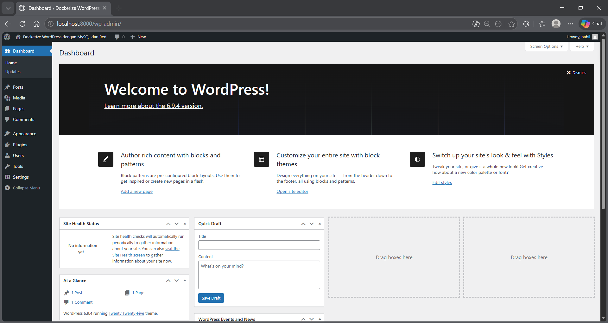
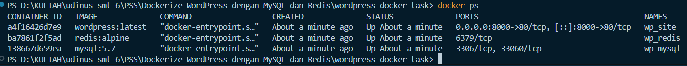
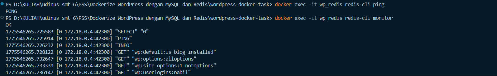
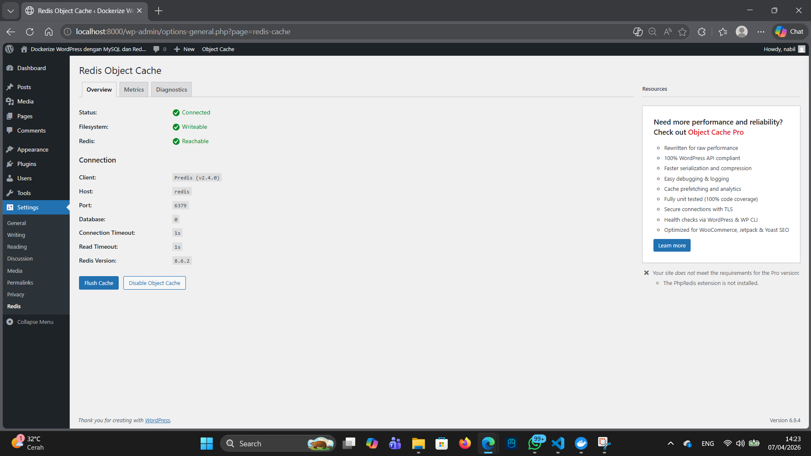

# Tugas: Dockerize WordPress dengan MySQL dan Redis

Tugas ini mendemonstrasikan setup CMS WordPress menggunakan Docker Compose dengan integrasi MySQL sebagai database dan Redis sebagai object cache untuk optimasi performa.

## Cara Menjalankan Stack
1. Pastikan Docker dan Docker Desktop sudah berjalan.
2. Clone repository ini atau masuk ke folder proyek.
3. Jalankan perintah berikut di terminal:
   ```bash
   docker-compose up -d
   ```
4. Akses WordPress di browser melalui alamat `http://localhost:8000`.

## Konfigurasi Redis Object Cache
Untuk mengaktifkan Redis, konfigurasi berikut ditambahkan pada file `wp-config.php`:
```php
define('WP_REDIS_HOST', 'redis');
define('WP_REDIS_PORT', 6379);
```
Serta mengaktifkan plugin **Redis Object Cache** melalui Dashboard WordPress.

## Dokumentasi & Screenshot

### 1. WordPress Dashboard


### 2. Docker Containers Running


### 3. Redis CLI Ping & Monitor Test


### 4. Redis Connected in WordPress


---

## Jawaban Pertanyaan Tugas

**1. Kenapa perlu volume untuk MySQL?**
Karena container bersifat *ephemeral* (sementara). Jika container MySQL dihapus atau di-restart tanpa volume, semua data database (postingan, user, dan settingan) akan hilang. Volume memetakan folder di dalam container (`/var/lib/mysql`) ke folder di host machine agar data tetap tersimpan secara permanen.

**2. Apa fungsi `depends_on`?**
Fungsinya adalah untuk mengatur urutan jalannya service. Dalam proyek ini, WordPress membutuhkan MySQL dan Redis agar bisa berfungsi. `depends_on` memastikan container MySQL dan Redis dijalankan lebih dahulu sebelum container WordPress dimulai.

**3. Bagaimana cara WordPress container connect ke MySQL?**
WordPress terhubung ke MySQL menggunakan fitur DNS Internal Docker. Karena berada dalam satu jaringan yang sama (`networks`), WordPress cukup memanggil nama service yaitu `mysql` (sebagagai host) dan Docker akan secara otomatis mengarahkan koneksi ke IP container MySQL yang tepat.

**4. Apa keuntungan pakai Redis untuk WordPress?**
Redis menyimpan hasil query database yang sering digunakan ke dalam memori (RAM). Ini mengurangi beban kerja database MySQL dan mempercepat waktu pemuatan halaman (load time) karena WordPress tidak perlu mengambil data yang sama berulang kali dari hard drive.

---
**Nama:** Muhammad Nabil Nazhmi Kurniali 
**NIM:** A11.2023.15366
```

