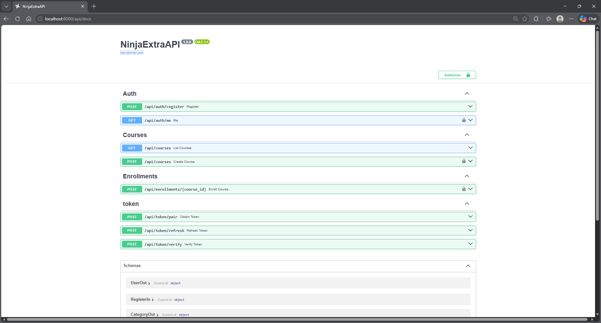

## Progress 3: REST API & Authentication System

### Fitur Utama:
- **Django Ninja**: Framework API performa tinggi dengan validasi Pydantic.
- **JWT Authentication**: Menggunakan `django-ninja-jwt` untuk sistem token (Access & Refresh).
- **RBAC (Role-Based Access Control)**: Implementasi hak akses berdasarkan role (Admin, Instructor, Student).
- **Swagger Documentation**: Dokumentasi API otomatis yang dapat diakses di `/api/docs`.

### Cara Menjalankan API:
1. Pastikan container berjalan: `docker-compose up -d`
2. Buka `http://localhost:8000/api/docs` untuk melihat dokumentasi.
3. Untuk endpoint yang diproteksi, gunakan token dari `/api/token/pair` dan masukkan ke tombol **Authorize** dengan format: `Bearer <token_anda>`.

### Deliverables:
- Postman Collection: `LMS_API.postman_collection.json` (terlampir di repository).
- Screenshot Swagger: `screenshots/swagger_docs.png`.

